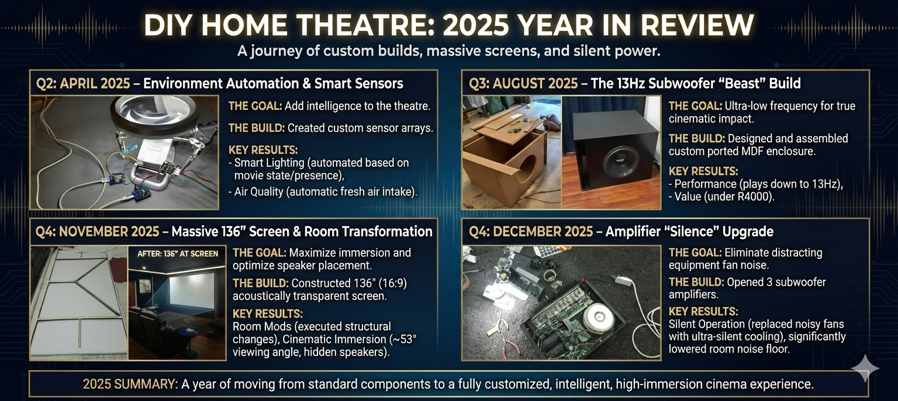
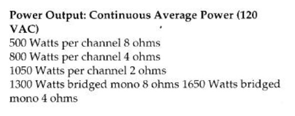

# The Cave: What a Consultant's Own Room Keeps Teaching

Most rooms reach a point where the owner stops asking questions.

The system is assembled. The major pieces are in place. The movies play and the music sounds fine. There is nothing obviously broken. And yet — if you sit in it long enough — you can feel the gap between what it does and what it should.

My own room, which I call The Cave, has never quite reached that stopping point. Not because it was never good enough. Because understanding a room more deeply always reveals the next thing worth solving.

That ongoing process — more than any single component in the rack — is what has shaped how I think about consulting on other people's spaces.

## The Room

The Cave is a 7.3.4 Dolby Atmos home theatre that has evolved over a long period of deliberate iteration. It runs a Denon 4800H as processor, a Yamaha RX-A3020 handling LCR in bi-amp configuration, B&W CM9s up front with a B&W HTM7 centre, 685s and 686s for surround and rear, and B&W in-ceiling CCM drivers for the Atmos layer. Three subwoofers — a 15-inch DIY build, a B&W ASW 800, and a converted Klipsch 115SW — handle the low end. The image comes from an Epson EH-TW9300 onto a 136-inch acoustically transparent fixed-frame screen.

What the spec list does not capture is why the room feels the way it does. That comes from the decisions behind it.

## 2025: The Year Accumulated Thinking Paid Off

Some years the room changes in ways that are easy to explain. A new component. A better cable route. A calibration session.

2025 was different. Several threads came together — a subwoofer build, an amplifier upgrade, a major screen rethink, a wall treatment, and a set of automation improvements — and the cumulative effect shifted the room from a well-assembled system to something far more personal and resolved.

Each project started from the same question: what is the room actually failing to do?

*A year of deliberate changes: the 13Hz sub build, the 136-inch screen, fan noise solved, automation that just works.*

## The Bass Problem Nobody Talks About

Low-frequency performance is the most commonly misunderstood part of a home cinema.

People talk about subwoofers in terms of driver size and amplifier watts. Those matter. But extension — how deep the system actually plays — is what determines whether a film feels physically real or merely loud. Most domestic systems roll off well above 30Hz. The cinematic standard reaches down to 20Hz and below. That gap is felt, not heard. It is the difference between a system that impresses and a room that genuinely unsettles you in the right scenes.

The Cave's third subwoofer was built specifically to address that gap. The brief was straightforward: play below 20Hz, fit the room, measure properly. The finished driver plays to approximately 13Hz. On paper that looks like an enthusiast specification. In practice it changed how certain films feel in the room — particularly anything with infrasonic content mixed into the soundtrack.

That kind of extension does not require an exotic budget. It requires understanding the problem first.

*Extension, not volume. The sub that shifted the room's low-frequency foundation.*

## Removing Noise Is Performance

When the plate amplifier in the Klipsch sub failed, the obvious path was replacement in kind.

The better path was to ask what an amplifier upgrade could achieve at the same time. The answer was more headroom and — crucially — a fundamentally quieter installation.

The amplifiers selected for the job were proper professional units with serious power reserves. They also came with cooling fans that were entirely unsuitable for a cinema room. Fan noise in a quiet passage, fan noise in a dialogue scene, fan noise between tracks — it is the kind of distraction that does not appear on a specification sheet but has an immediate effect on how a room feels.

Replacing the stock fans with silent units dropped the background noise from the amplifiers by more than 30dB. The room did not get louder. It got quieter. And that quietness — that lower noise floor — made every other aspect of the system's performance more apparent.

This is a principle that applies across rooms: performance is not only about what you add. Often the most valuable upgrade is removing the thing that keeps pulling you out of the experience.

*The Klipsch after the amplifier conversion: more control, more headroom, quieter room.*

*The amplifier that brought the sub back — and dropped the room noise floor with it.*

## Screen Size Is a Geometry Problem

There is a moment in most home theatre rooms where the screen starts to feel too small.

It usually happens after the sound has improved significantly. The contrast between what you hear and what you see becomes more obvious. The viewing angle — the real measure of immersion, not raw screen inches — starts to feel insufficient from the main seats.

The instinct is to buy a larger screen and fit it where the current one hangs. That instinct is often wrong.

In The Cave, the constraints of the front wall meant that going wider was not the productive direction. What the room actually needed was a larger viewing angle from the seated position — which is a different problem with a different solution. The answer was to bring the screen further into the room, changing the geometry of the relationship between image and audience.

That required understanding the room in three dimensions before touching anything. I modelled it at scale in Blender. Once the geometry was visible, the solution became obvious in a way it never would have been from measuring tape and guesswork.

The result was a move from a 100-inch screen to a 136-inch screen without widening the front wall — and a viewing angle that changed the cinematic character of the room completely.

The projector mount had to be rebuilt to accommodate the new throw relationship. That turned into its own project: a fully adjustable ceiling bracket built from threaded rod, allowing fine positional control that the original fixed mount never offered.

The 136-inch image did not feel like an incremental improvement. It felt like a different room.

*The room in Blender. Understanding the geometry before committing to the solution.*

*The brackets built for the new screen position.*

*Before: a 100-inch screen in its original position.*

*After: the same room, the same wall — a different viewing experience.*

*The finished result.*

*The mount rebuilt to suit the new throw relationship.*

## The Wall You Stop Seeing

Once the screen moved, the wall to its left became the next problem.

It was bright and reflective — appropriate for a room that was once a dual-purpose lounge, entirely wrong for a dedicated cinema. It did not show up in any measurement. No analyser would flag it. But it created a visual field around the image that softened the sense of immersion and reminded the eye, subconsciously, that it was looking at a screen in a room rather than a window into something else.

The fix was a timber-framed black fabric panel, built and installed during the December break. The acoustic treatment from the left wall was incorporated into it.

The measured improvement to the image was modest. The perceptual change was significant. The screen stopped competing with the surrounding surface and started to float. The room felt more intentional. More focused. Like the decision had always been made.

This is consistently one of the most underestimated variables in home cinema: the visual field surrounding the image matters as much as the image itself.

*Before: bright walls pulling attention away from the screen.*

*The panel going in.*

*Detail during construction.*

*After: a darker visual field that lets the screen hold the eye properly.*

## Automation That Disappears

A cinema can measure well and still be frustrating to use.

Lighting logic that requires manual intervention, ventilation that runs when it should not or not when it should, occupancy sensing that is absent — these things do not show up in a frequency response plot. But they shape how a room feels to live with, every single session.

In 2025 the room gained an automated fresh-air intake controlled by an air-quality sensor, and a presence-sensing system built around millimetre-wave radar monitoring projector and player states. Foot lights now respond automatically when a film is paused or resumed. Main lights react when the projector is off and people enter or leave the room.

None of this is perceptible as technology once it is working. The room simply behaves correctly. That invisibility is the goal. Automation that draws attention to itself has failed.

## What the Room Keeps Proving

These projects did not happen in isolation, and they were not chosen randomly.

Each one addressed something the room was failing to do. The subwoofer build extended the low-frequency foundation. The amplifier conversion added headroom and removed distraction. The silent fan upgrade lowered the noise floor. The screen rethink improved viewing geometry. The wall treatment focused the visual field. The automation made the room easier to use and more satisfying to return to.

Taken together, the cumulative effect is a room that performs far beyond what its component list suggests on paper — not because of what was spent, but because each decision was aimed at a specific, correctly identified problem.

That is the principle PureWave brings to client rooms.

Most systems that feel disappointing are not missing an expensive component. They are missing a clear understanding of what is actually failing. Once that is identified, the right solution — whether that is calibration, room treatment, a single targeted upgrade, or a complete rethink — becomes obvious.

Measured decisions instead of forum folklore.

Better movies. Better music. Worth every rand.

---

